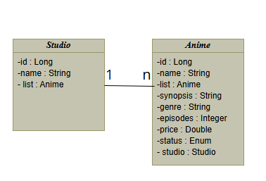

# **✨Anime CRUD✨**

Esse é um projeto simples que desenvolvi para estudar com Spring boot, que implementa um CRUD para gerenciar animes e estúdios.

## 🚀Funcionalidades

- CRUD para anime e estúdio
- Buscas por id
- Relacionamento de tabelas
- Validações
- Tratamento de exeções

### 🗒️Boas Práticas 
- Arquitetura em camadas
- DTOS
- Tratamento com handler global
- Exeções personalizadas

## ⚙️Tecnologias 

- Java 21 + Spring Boot 3.5.6
- Spring Data JPA
- Spring Validation
- H2 Database

### Diagrama 

